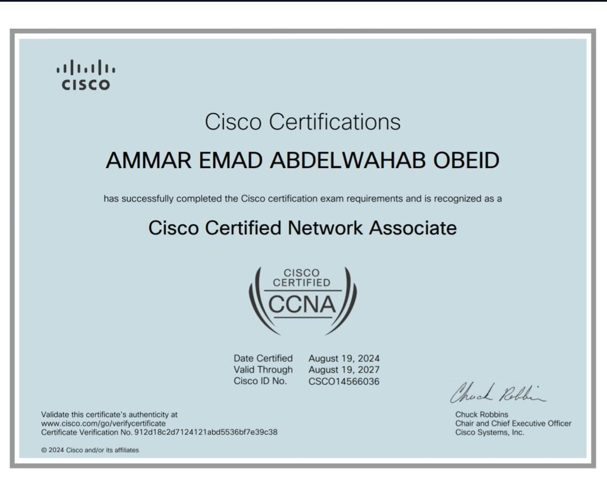
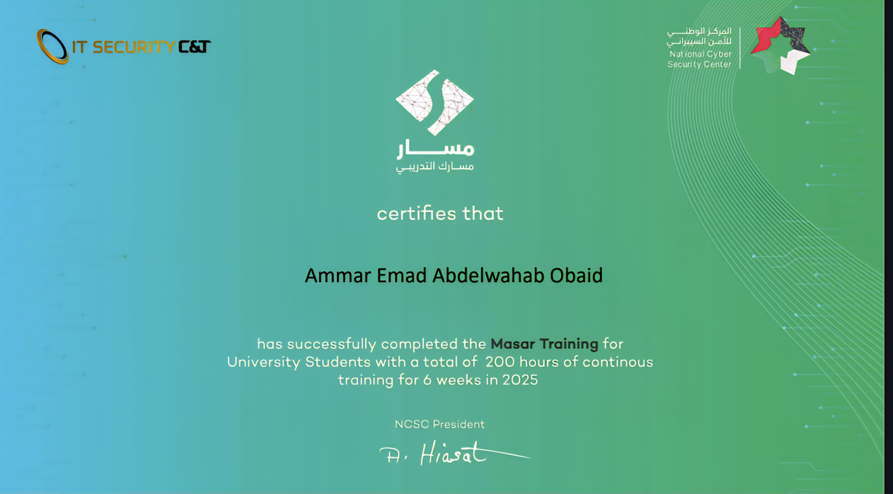
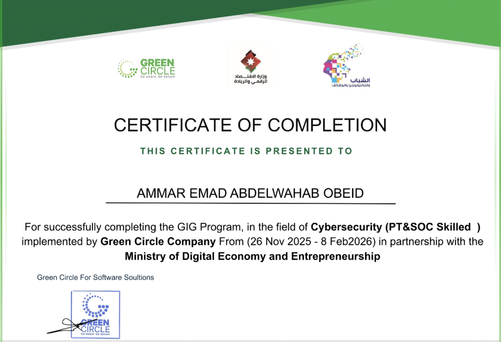

# Ammar Obaid

Cybersecurity Enthusiast | SOC Analyst | Penetration Tester  
Passionate about security tools development, SOC operations, and vulnerability assessment.

---

## About Me

Hi! I am Ammar Obaid, a cybersecurity enthusiast with experience in penetration testing, SOC monitoring, and network security. I enjoy building tools and dashboards to help secure systems and analyze threats effectively.

---

## Certifications & Training

### Certifications
- **CCNA** – Cisco Certified Network Associate  
- **CCT** – Cisco Certified Technician

### Training
- **NCSCJO** – National Cyber Security Center Jordan Training  
- **Green Circle for Cybersecurity** – Security Training Program  

### Certificate Images
  
  
  
  

---

## Projects

### DAN-TOOLS
A cybersecurity toolkit with multiple utilities for penetration testing and network security assessments.  
[GitHub Link](https://github.com/username/DAN-TOOLS)

### SOC Dashboard
A Security Operations Center dashboard to visualize alerts, logs, and threat activities.  
[GitHub Link](https://github.com/username/SOC-Dashboard)

---

## Skills

- Network Security & Firewalls  
- Penetration Testing & Ethical Hacking  
- SOC Monitoring & Incident Response  
- Linux & Python Scripting  
- Security Tools Development  

---

## Contact

🔗 LinkedIn: [linkedin.com/in/username](https://linkedin.com/in/username)
📧Email: ammar.eobeid@gmail.com  
Phone Number : +962796555477
